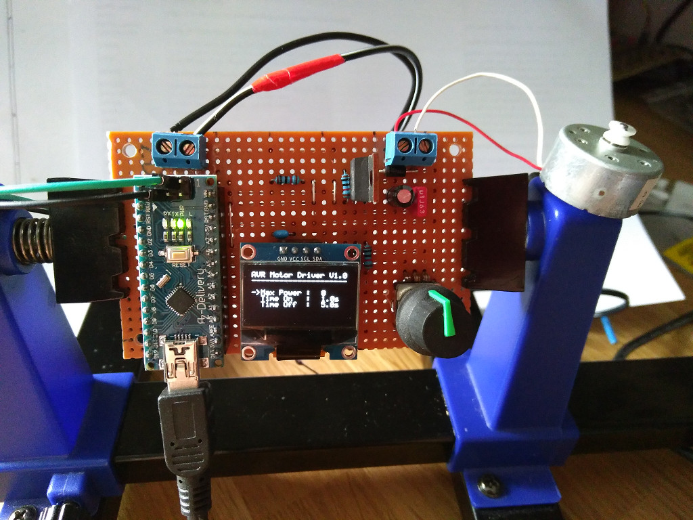

# AVR Motor Driver
The idea of this project is to control a small water pump, which is used to 
cool down the milling head of a cnc machine. For a flexible cooling interval, 
it is possible to set the maximum power the pump will receive and the time
the pump is running / paused. 

As an example, the pump could run with 50% for a period of 10 seconds and after
that pause for 5 seconds. 

# Build the Project
```
    cd src
    make hex
```

# Schematic 
The schematic is located under `files/schematic-avr-motor-driver.pdf`  

# Picture 
This is a picture for the prototype board with one of the first working software
revisions. 




